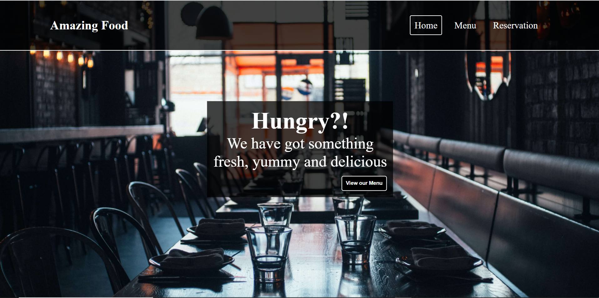

# Restaurant-page

> Restaurant Homepage with Tabbed Navigation.

- This project is to demonstrate the use of ES6 and Webpack.

- The project is a sample homepage for a restaurant with the content of the page generated using Javascript modules being bundled with the use of Webpack

- A major feature of the page is the Tabbed navigation implemented with the use of Javascript.

## Built With

- HTML
- CSS
- Javascript
- Webpack

## Getting Started

To get a local copy up and running follow these simple example steps.

- Create a local clone of the repo by running 
`git clone git@github.com:AdedayoOpeyemi/Portfolio-Opeyemi.git`
- run `npm install` to get all dependencies

## Authors

👤 **Opeyemi Oyelesi**

- Github: [Opeyemi Oyelesi](https://github.com/AdedayoOpeyemi)
- Linkedin: [Opeyemi Oyelesi](https://www.linkedin.com/in/opeyemioyelesi/)

## 🤝 Contributing

Contributions, issues and feature requests are welcome!

Feel free to check the [issues page](issues/).

## Show your support

Give a ⭐️ if you like this project!

## Acknowledgments

- Thanks to Microverse and its awesome community

## 📝 License

This project is [MIT](https://opensource.org/licenses/MIT) licensed.
